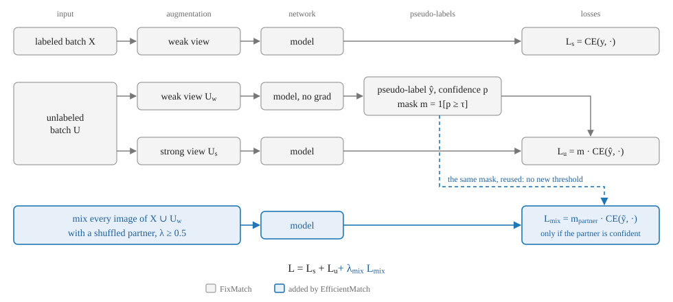
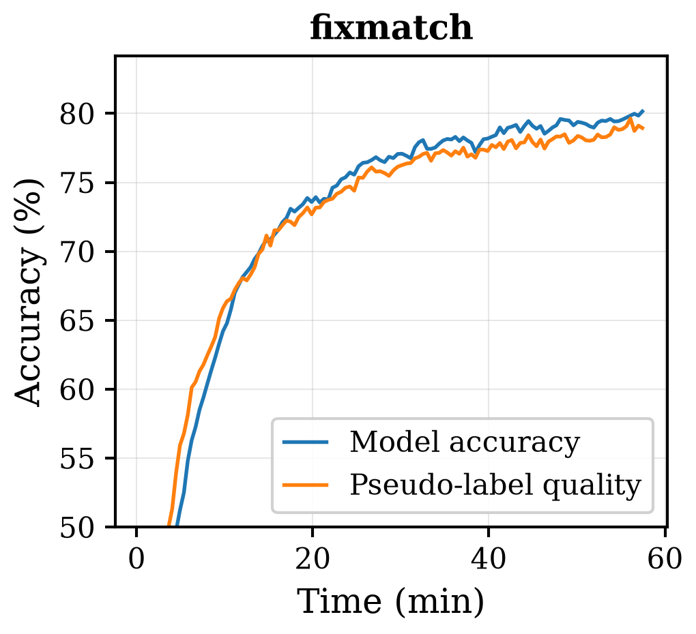
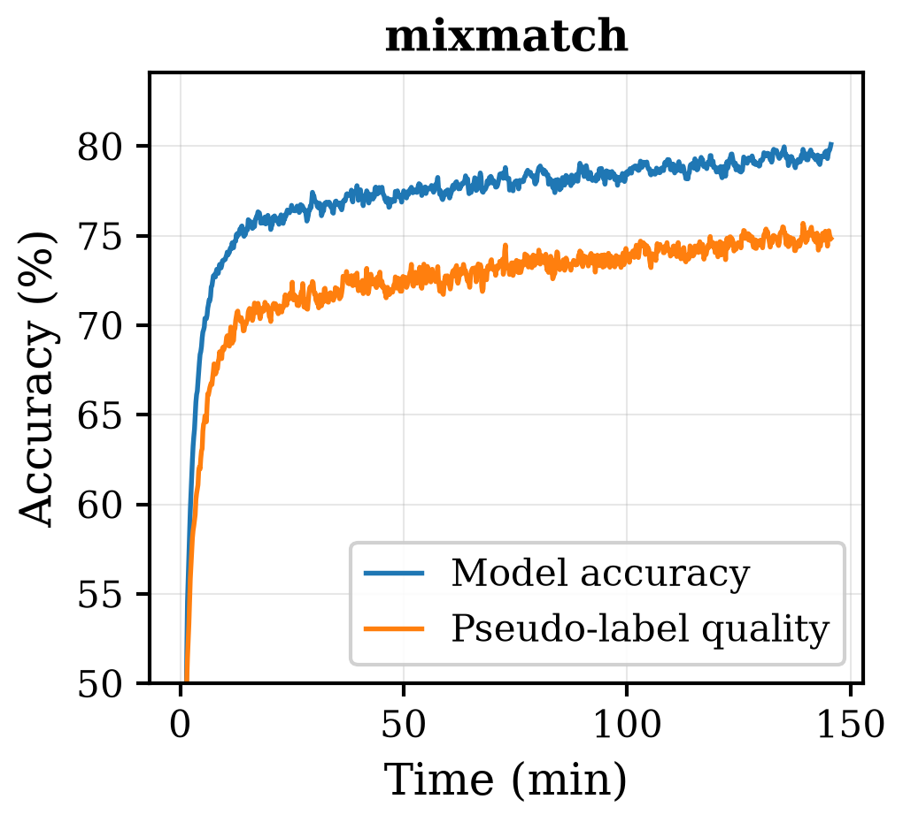
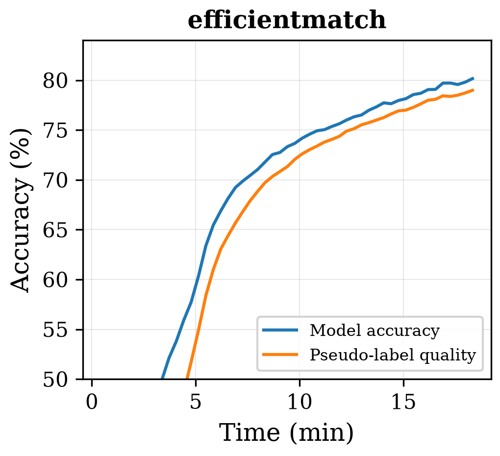
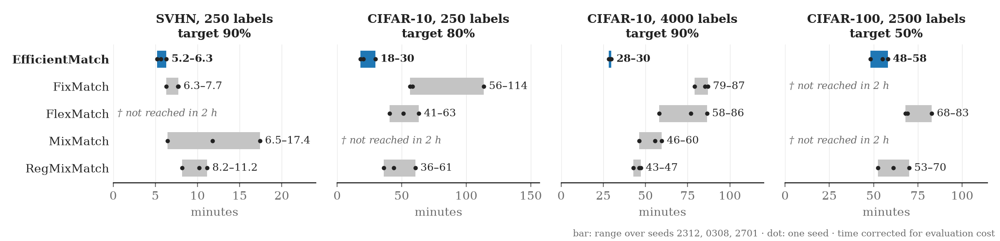
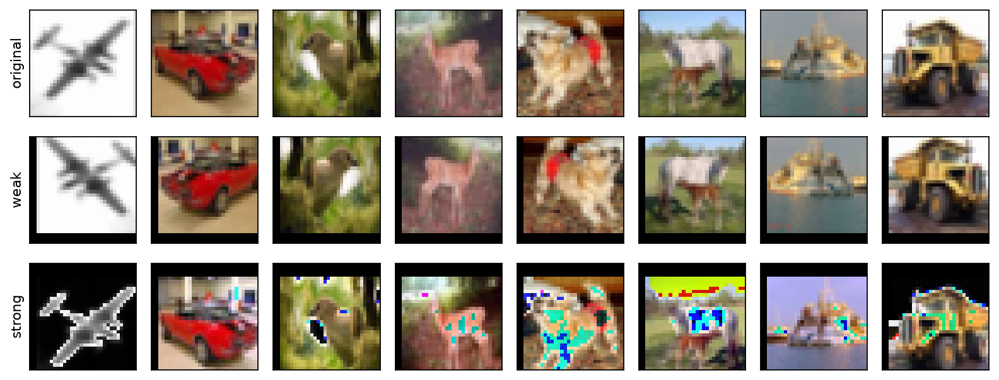
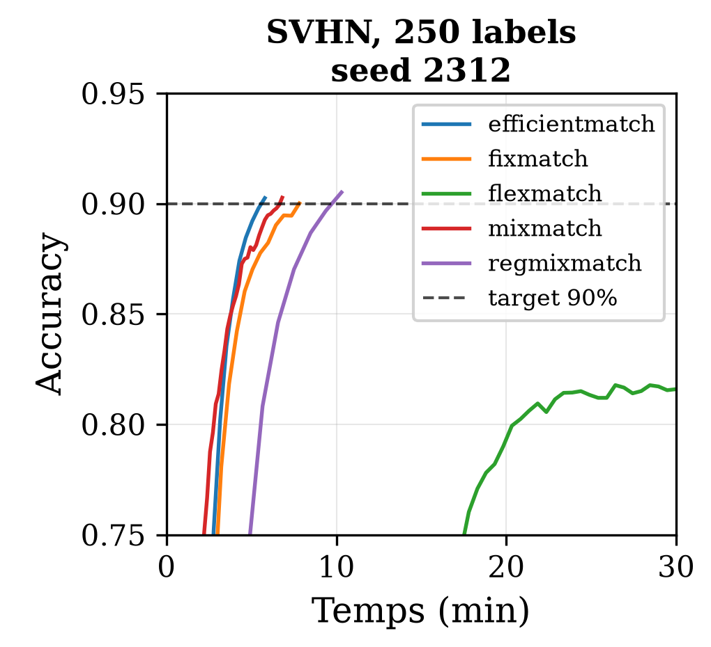
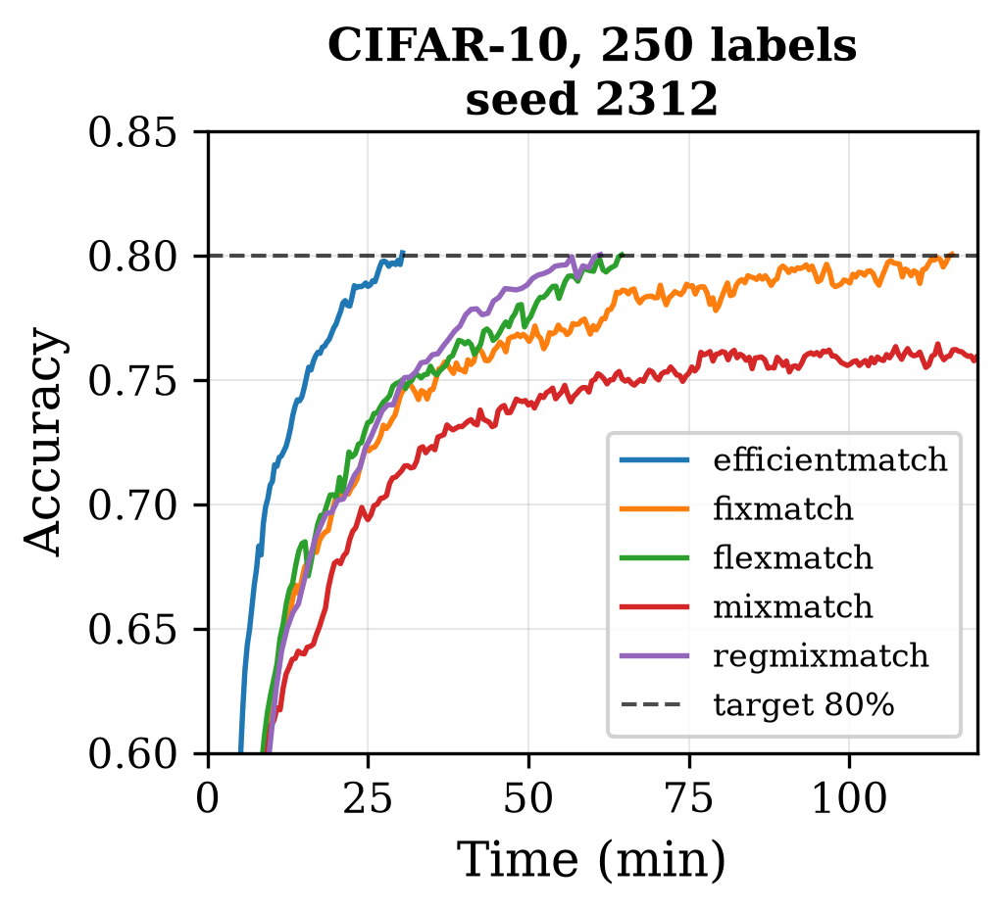
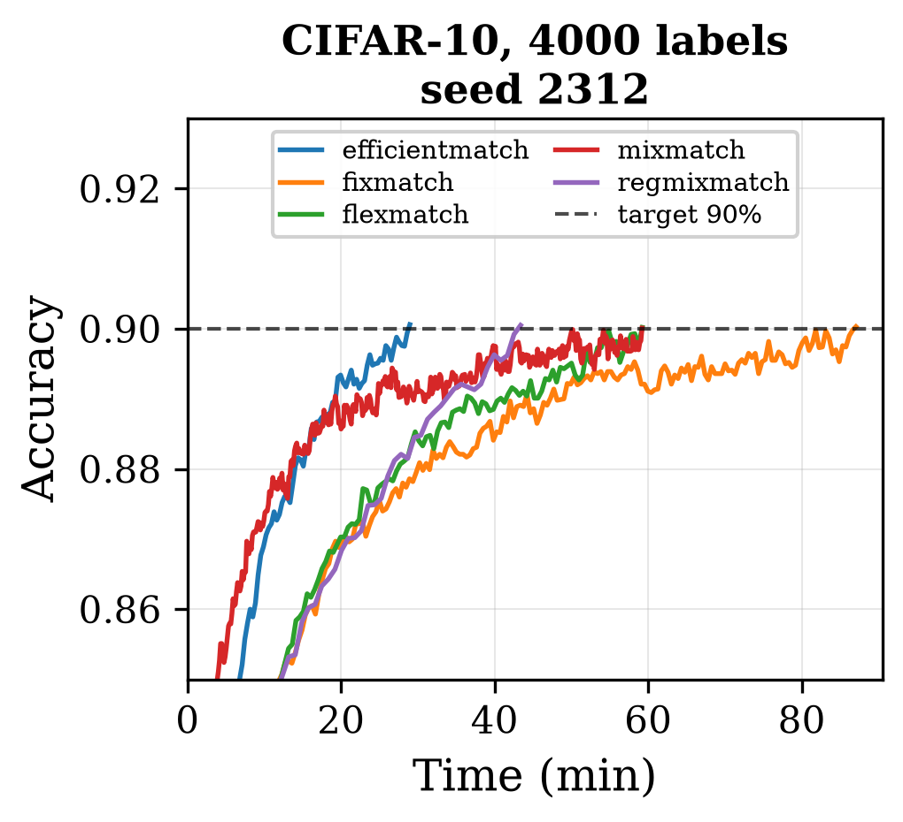
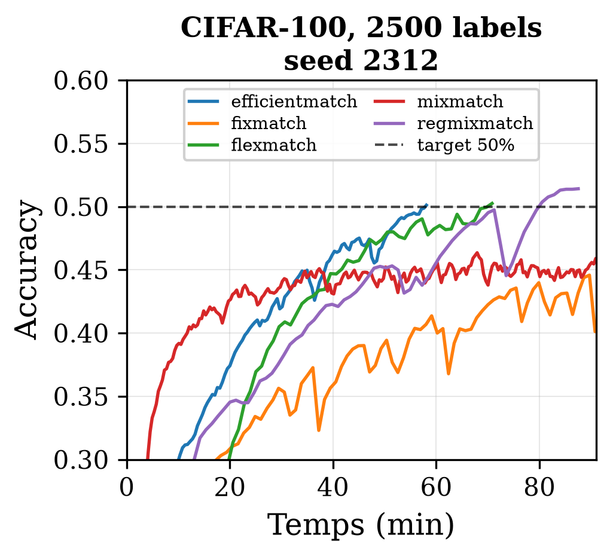

# EfficientMatch: Faster Convergence in Semi-Supervised Learning

<p align="center">
  
  
  
  
</p>

Code and results for the paper, included here as [`paper.pdf`](paper.pdf).

Semi-supervised learning is usually evaluated on the accuracy a method eventually reaches, after a
fixed budget of 2^20 iterations. This work asks the complementary question — **which method reaches
a useful accuracy at the lowest computational cost?** — and proposes EfficientMatch, a method
designed for that regime.

EfficientMatch adds a Mixup channel to FixMatch's filtered consistency loss, and filters it with the
confidence mask the consistency loss has already computed, so no new threshold is introduced. The
whole contribution is the ~40 lines building `loss_mixup` in
[`scripts/efficientmatch.py`](scripts/efficientmatch.py).

<p align="center">
  
</p>

The idea comes from what the two parent methods do to the pseudo-labels they train on. FixMatch's
accuracy tracks the quality of the pseudo-labels it keeps; MixMatch's model overtakes the quality of
its own pseudo-labels. EfficientMatch keeps both properties (Figure 1 of the paper, CIFAR-10/250,
seed 2701):

<p align="center">
  
  
  
</p>

Across the twelve seed/configuration combinations reported, EfficientMatch reaches the target
accuracy in less wall-clock time and fewer FLOPs than MixMatch, FixMatch, FlexMatch and RegMixMatch,
without exception.

<p align="center">
  
</p>

There are three ways into the code: [`run_experiment.py`](run_experiment.py) and
[`make_figures.py`](make_figures.py) reproduce every run and figure of the paper; the
[notebooks](notebooks/) lay out each method cell by cell, to read and modify; and
[docs/implementation_notes.md](docs/implementation_notes.md) lists the implementation details
the paper does not show.

## Install

```bash
pip install -r requirements.txt
```

A CUDA GPU is expected. Every result here was produced on a single NVIDIA RTX 5060 Ti (8 GB), which
is what constrains CIFAR-100 to WideResNet-28-4. Datasets download themselves into `data/` on first
use.

## Reproduce one number in five minutes

The fastest cell of the main table is EfficientMatch on SVHN, which reaches 90% in under six
minutes:

```bash
python scripts/efficientmatch.py --dataset svhn --num_labeled 250 --seed 2312 --target_acc 0.90 --tag repro
```

It writes `results/svhn-labeled-250-seed-2312/efficientmatch_ema_repro_metrics.json`, next to the
paper's own `efficientmatch_ema_metrics.json` rather than over it: without `--tag`, a script run on a
paper configuration overwrites the paper's result file. Compare your run with the paper's and with
the other methods on that configuration:

```bash
python scripts/run_analysis.py compare --dataset svhn --num_labeled 250 --seed 2312
```

## Reproduce the paper

Two entry points cover everything. Neither re-runs work that is already on disk.

```bash
python run_experiment.py --list      # the experiments, the tables they feed, how many are done
python run_experiment.py --check     # verify every run the paper reports has its result file
python run_experiment.py --experiment main --dry-run    # see the exact commands first
python run_experiment.py --experiment main              # then run them
```

```bash
python make_figures.py --list        # the figures and how each is produced
python make_figures.py               # draw whatever is missing from figures/
```

`--experiment` takes `main`, `mu`, `lambda-mix`, `mixing-target`, `matched-mu`, `freematch`,
`freematch-noclamp` or `asymptotic`, and `--config`, `--method` and `--seed` narrow it further. The
main sweep is 60 runs of up to two hours each, so start with `--dry-run`.

To dispatch the runs yourself rather than from here, `python run_experiment.py --commands` prints
them as plain command lines; the same list is written out in
[docs/reproducing.md](docs/reproducing.md).

## Notebooks

To read a method or change it, [`notebooks/`](notebooks/) holds one notebook per method and one for
the figures. Each method notebook writes out everything the method does (data split,
augmentations, losses, training loop, evaluation) in commented cells, runs a 1,000-iteration test
by default, and is the same computation as its script at the default settings. `figures.ipynb`
draws Figures 1 to 5 from `results/` and plots any other run, without a GPU. See
[notebooks/README.md](notebooks/README.md).

<p align="center">
  
</p>

## Results

Wall-clock minutes to reach the target accuracy, corrected for evaluation cost, per seed. `†` marks
a method that never reached the target within the two-hour budget.

| Method | SVHN-250 (90%) | CIFAR-10-250 (80%) | CIFAR-10-4000 (90%) | CIFAR-100-2500 (50%) |
|---|---|---|---|---|
| **EfficientMatch** | **5.7 / 5.2 / 6.3** | **29.6 / 20.3 / 17.9** | **28.2 / 29.3 / 29.8** | **55.1 / 48.1 / 58.0** |
| FixMatch | 7.7 / 6.3 / 7.7 | 113.7 / 58.2 / 56.3 | 85.2 / 79.1 / 86.9 | † |
| FlexMatch | † | 63.3 / 51.3 / 40.7 | 58.1 / 86.4 / 76.8 | 69.2 / 82.8 / 68.0 |
| MixMatch | 6.5 / 17.4 / 11.8 | † | 55.5 / 59.6 / 46.3 | † |
| RegMixMatch | 10.2 / 8.2 / 11.2 | 60.6 / 43.8 / 36.1 | 42.9 / 46.2 / 47.2 | 61.0 / 52.5 / 70.1 |

Accuracy against time on the four configurations, seed 2312 (Figure 4 of the paper; the dashed
line is the target):

<p align="center">
  
  
  
  
</p>

Iterations and FLOPs, the two other metrics the paper reports, are in
[`docs/main_experiment.md`](docs/main_experiment.md). They do not rank the methods the same way,
which is the point: RegMixMatch converges in the fewest iterations everywhere, and is still slower
and more FLOP-costly, because each of its iterations is much more expensive.

## Documentation

| Document | Covers |
|---|---|
| [docs/main_experiment.md](docs/main_experiment.md) | The five methods on the four configurations (Tables 2, 3, 12, 13), and the FreeMatch-thresholding variant (Table 4, Appendix A.5) |
| [docs/ablations.md](docs/ablations.md) | Unlabeled ratio mu, Mixup weight, mixing target, matched-mu study (Tables 5 to 8, Table 10) |
| [docs/threshold_sensitivity.md](docs/threshold_sensitivity.md) | How the ranking moves when the target accuracy is lowered (section 6) |
| [docs/fast_fixmatch.md](docs/fast_fixmatch.md) | Why Fast FixMatch's FLOP gain does not become a wall-clock gain here (Table 9, Appendix A.4) |
| [docs/asymptotic.md](docs/asymptotic.md) | What happens with no accuracy target at all (Table 11, Appendix A.8) |
| [docs/flops.md](docs/flops.md) | FLOPs per iteration for every method, and the cost of one evaluation (Appendix B) |
| [docs/reproducing.md](docs/reproducing.md) | Every run behind the paper, as a plain list of commands |
| [docs/implementation_notes.md](docs/implementation_notes.md) | Implementation details the paper does not show: batch-level augmentation, MixMatch's supervised term, RegMixMatch's uncounted warmup, departures from reference code |
| [notebooks/README.md](notebooks/README.md) | One notebook per method, to read and modify cell by cell, and one for Figures 1 to 5 |
| [results/README.md](results/README.md) | How result files are named and which ones the paper uses |

## Repository layout

```
run_experiment.py        Run any experiment in the paper
make_figures.py          Redraw any figure in the paper, and the ones in these READMEs

scripts/
  efficientmatch.py      The method of the paper. Its ablations are options on it:
                         --mixing_target (Table 8), --mixup_weight (Table 7),
                         --mu (Tables 5, 6), --freematch_threshold (Table 4)
  fixmatch.py  flexmatch.py  mixmatch.py  regmixmatch.py    The four baselines
  fast_fixmatch.py       Curriculum batch size, measured separately (Appendix A.4)

  common/                Everything identical across methods: the shared options,
                         the dataset split and augmentations, the model and
                         optimiser, the metrics and the periodic evaluation
  models.py  ema.py  utils.py  datasets_utils.py            Architecture and helpers

  run_analysis.py        Compare methods on one configuration, from the result files
  flops_analysis.py      FLOPs per iteration, on dummy tensors
  measure_eval_time.py  ghost_method.py                     Cost of one evaluation pass
  best_method_by_threshold.py                               Regenerates docs/threshold_sensitivity.md
  plot_acc_vs_time.py  plot_acc_vs_pl.py  plot_ablation_mixw*.py    Figures

notebooks/               The same methods, cell by cell, to read and modify; and the figures
results/                 One JSON per run, see results/README.md
figures/                 Every figure in the paper
docs/                    Detailed results, organised by paper section
```

Each method is a **standalone script**: its training loop, augmentations and hyperparameters all
live in one file, and only what is identical across methods by construction — the architecture, the
EMA, the evaluation, the dataset split — is shared. Reading `fixmatch.py` next to
`efficientmatch.py` shows the whole difference between the two methods, with nothing hidden in a
framework.

## Protocol in brief

Each run stops when the EMA accuracy reaches its target, or after two hours
(`--target_acc`, `--max_minutes`). Reported time is corrected for the cost of the periodic
evaluations, which is identical across methods for a given architecture. Each method keeps the
unlabeled:labeled ratio established for it in the literature: mu = 7 for FixMatch, FlexMatch and
RegMixMatch, mu = 1 for MixMatch, mu = 3 for EfficientMatch. Full hyperparameters are in Table 14 of
the paper, and every default is visible with `--help` on any script.

## Licence

[MIT](LICENSE)
