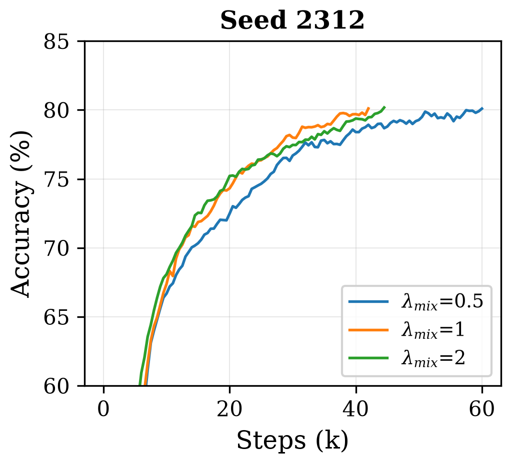
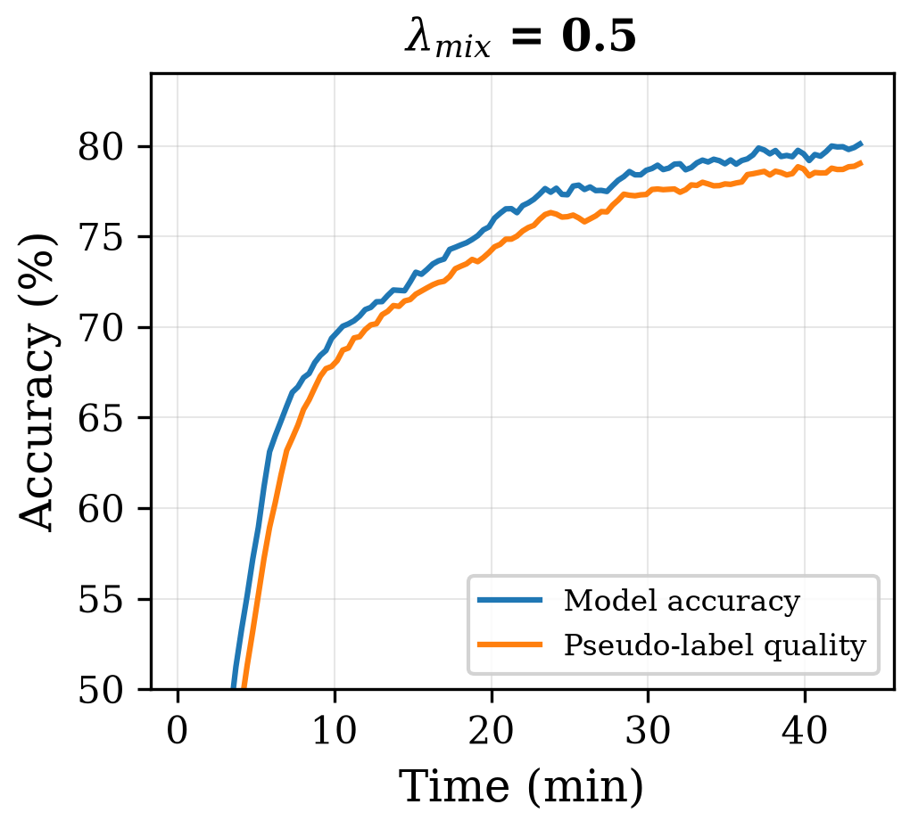
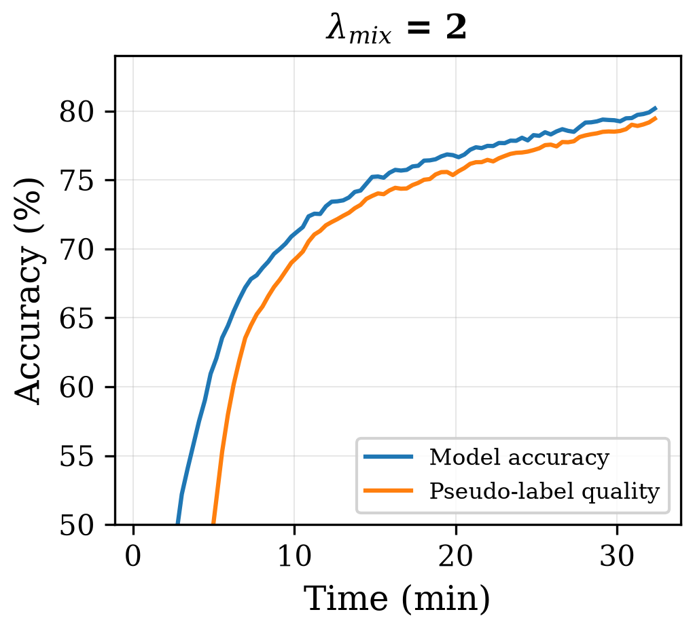

# Ablations

Backs **Tables 5 to 8 and Table 10** of the paper (Appendices A.1, A.2, A.3 and A.6). Every run uses
the same protocol as the main experiment: stop at the target accuracy or at two hours, three seeds,
`†` marks a run that never reached its target and is excluded from rankings, with the accuracy it
plateaued at in parentheses.

```bash
python run_experiment.py --experiment mu             # Tables 5, 6
python run_experiment.py --experiment lambda-mix     # Table 7
python run_experiment.py --experiment mixing-target  # Table 8
python run_experiment.py --experiment matched-mu     # Table 10
```

## A.1 — Unlabeled ratio mu (Tables 5 and 6)

How many unlabeled samples EfficientMatch draws per labeled sample at each iteration.

**CIFAR-10, 250 labels, target 80%**

| mu | steps (×1000) | | | corrected time (min) | | | PFLOPs | | |
|---|---:|---:|---:|---:|---:|---:|---:|---:|---:|
| seed | 2312 | 0308 | 2701 | 2312 | 0308 | 2701 | 2312 | 0308 | 2701 |
| 1 | † (77.6%) | † (79.8%) | 215.5 | † | † | 87.4 | † | † | 76.8 |
| **3 (default)** | 42.0 | 28.5 | 25.0 | **29.6** | 20.3 | 17.9 | **31.1** | **21.1** | **18.5** |
| 5 | 28.5 | **17.0** | 18.5 | 30.0 | **18.1** | 19.6 | 32.0 | 19.1 | 20.8 |
| 7 | **25.5** | 18.5 | **15.5** | 35.8 | 26.9 | 22.6 | 38.5 | 27.9 | 23.4 |

**CIFAR-10, 4000 labels, target 90%**

| mu | steps (×1000) | | | corrected time (min) | | | PFLOPs | | |
|---|---:|---:|---:|---:|---:|---:|---:|---:|---:|
| seed | 2312 | 0308 | 2701 | 2312 | 0308 | 2701 | 2312 | 0308 | 2701 |
| 1 | 99.5 | 101.5 | 100.5 | 39.6 | 42.3 | 39.6 | 35.5 | 36.2 | 35.8 |
| **3 (default)** | 41.0 | 41.0 | 43.5 | **28.2** | **29.3** | **29.8** | **30.4** | **30.4** | **32.2** |
| 5 | 32.0 | 34.5 | 30.5 | 33.6 | 37.7 | 32.0 | 36.0 | 38.8 | 34.3 |
| 7 | **26.0** | **25.5** | **26.0** | 36.4 | 35.7 | 36.5 | 39.2 | 38.5 | 39.2 |

On both 250 and 4000 labels, and across all three seeds, mu = 3 minimizes total FLOPs among the
configurations that converge reliably. The relationship is not monotonic: mu = 1 fails on two of
three seeds at 250 labels, where the consistency signal is too sparse and unstable across seeds, but
converges reliably at 4000 labels, where the richer supervised signal compensates. Beyond mu = 3 the
FLOP cost grows without measurable and consistent benefit; it is a resource trade-off rather than a
quality one.

## A.2 — Weight of the Mixup loss (Table 7)

`lambda_mix` scales the Mixup term in the total loss. A value near 0 pushes EfficientMatch towards a
FixMatch with mu = 3, while a value much greater than 1 overweights the mixing term and brings it
closer to standard MixMatch behaviour, with a larger gap between pseudo-label quality and model
accuracy and faster convergence early in training (see the figure below).

**CIFAR-10, 250 labels, target 80%**

| lambda_mix | steps (×1000) | | | corrected time (min) | | | PFLOPs | | |
|---|---:|---:|---:|---:|---:|---:|---:|---:|---:|
| seed | 2312 | 0308 | 2701 | 2312 | 0308 | 2701 | 2312 | 0308 | 2701 |
| 0.5 | 60.0 | 35.5 | 30.5 | 42.4 | 25.6 | 21.8 | 44.4 | 26.3 | 22.6 |
| **1 (default)** | 42.0 | 28.5 | 25.0 | **29.6** | **20.3** | **17.9** | **31.1** | **21.1** | **18.5** |
| 2 | 44.5 | 36.5 | 27.5 | 31.5 | 26.0 | 19.7 | 32.9 | 27.0 | 20.4 |

The default is best in both time and FLOPs on all three seeds. The degradation is roughly symmetric
around it, and heavier on the under-weighted side.

<p align="center">
  
  
  
</p>

*Figure 3 of the paper, seed 2312: accuracy for the three Mixup weights (left), then pseudo-label
quality against model accuracy for lambda_mix = 0.5 (middle) and lambda_mix = 2 (right).*

## A.3 — What the Mixup channel is trained against (Table 8)

Three ways of forming the label used in the Mixup loss:

1. **Hard** — the label is the one of the original sample, treating the mixed sample as a plain
   augmentation rather than a true Mixup.
2. **Semi-soft** — the linear combination of the anchor's label and the mixing partner's label. This
   is the version retained in the paper.
3. **Soft** — the linear combination of the anchor's label and the softmax distribution of the
   mixing partner, yielding a noisier label.

**CIFAR-10, 250 labels, target 80%**

| variant | steps (×1000) | | | corrected time (min) | | | PFLOPs | | |
|---|---:|---:|---:|---:|---:|---:|---:|---:|---:|
| seed | 2312 | 0308 | 2701 | 2312 | 0308 | 2701 | 2312 | 0308 | 2701 |
| Hard | 45.0 | 55.5 | 34.0 | 32.6 | 39.1 | 23.7 | 33.3 | 41.1 | 25.2 |
| **Semi-soft (default)** | 42.0 | 28.5 | 25.0 | **29.6** | **20.3** | 17.9 | **31.1** | **21.1** | 18.5 |
| Soft | 46.0 | 29.0 | 21.5 | 32.6 | 20.7 | **15.4** | 34.1 | 21.5 | **15.9** |

Not reported in the paper, the same comparison on **SVHN, 250 labels, target 90%** points the same
way:

| variant | steps (×1000) | | | corrected time (min) | | | PFLOPs | | |
|---|---:|---:|---:|---:|---:|---:|---:|---:|---:|
| seed | 2312 | 0308 | 2701 | 2312 | 0308 | 2701 | 2312 | 0308 | 2701 |
| Hard | 8.5 | 8.5 | 10.0 | 6.6 | 6.6 | 7.7 | 6.3 | 6.3 | 7.4 |
| **Semi-soft (default)** | 7.0 | 6.5 | 8.0 | **5.7** | **5.2** | **6.3** | **5.2** | **4.8** | **5.9** |
| Soft | 9.0 | 7.0 | 8.0 | 7.1 | 5.6 | 6.3 | 6.7 | 5.2 | 5.9 |

## A.6 — FixMatch and RegMixMatch at matched mu (Table 10)

To check that EfficientMatch's advantage does not simply come from its smaller per-iteration
unlabeled batch, FixMatch and RegMixMatch are run at mu = 3 as well, on CIFAR-10/250.

| method (mu = 3) | steps (×1000) | | | corrected time (min) | | | PFLOPs | | |
|---|---:|---:|---:|---:|---:|---:|---:|---:|---:|
| seed | 2312 | 0308 | 2701 | 2312 | 0308 | 2701 | 2312 | 0308 | 2701 |
| FixMatch | 202.5 | 197.0 | 110.0 | 93.6 | 91.3 | 51.1 | 172.1 | 167.5 | 93.5 |
| RegMixMatch | † (76.3%) | † (72.2%) | 35.5 | † | † | 28.2 | † | † | 32.1 |
| **EfficientMatch** | **42.0** | **28.5** | **25.0** | **29.6** | **20.3** | **17.9** | **31.1** | **21.1** | **18.5** |

At matched mu, FixMatch remains far more expensive than EfficientMatch, compensating for the reduced
unlabeled batch with substantially more iterations rather than converging faster overall — it stays
5.1x to 7.9x more FLOP-costly. RegMixMatch, in contrast, becomes unstable at this reduced mu: it
fails to reach 80% on two of the three seeds, and on the third only converges after an initial
attempt crashed almost immediately. This confirms that EfficientMatch's Mixup channel supplies a
structurally richer per-iteration signal, rather than merely trading unlabeled-batch size against
speed.
