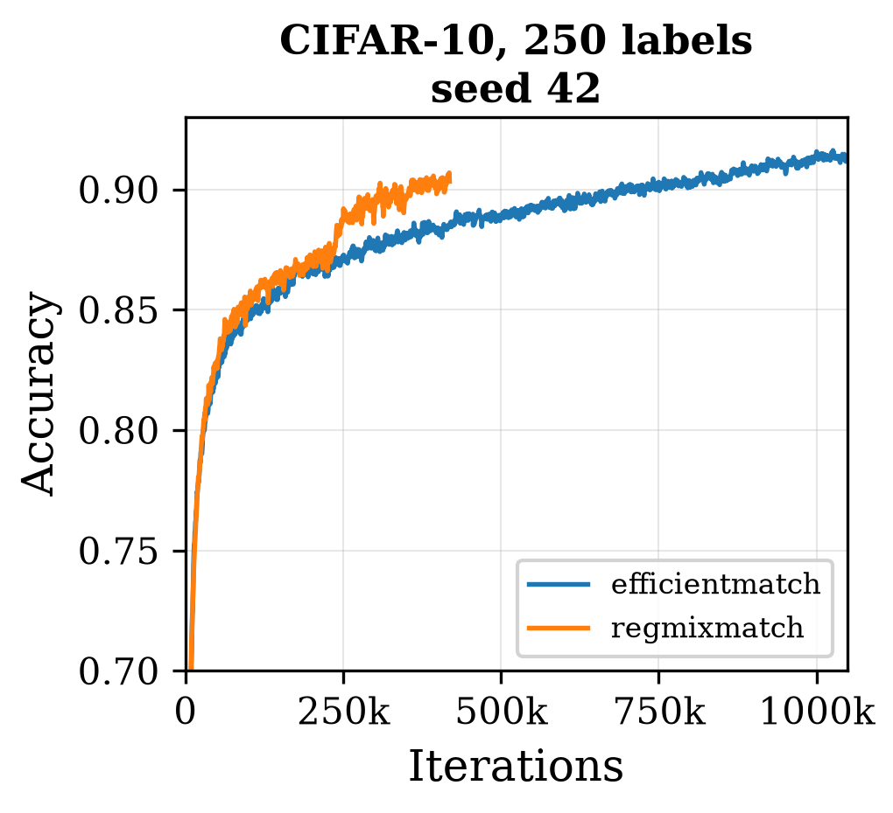
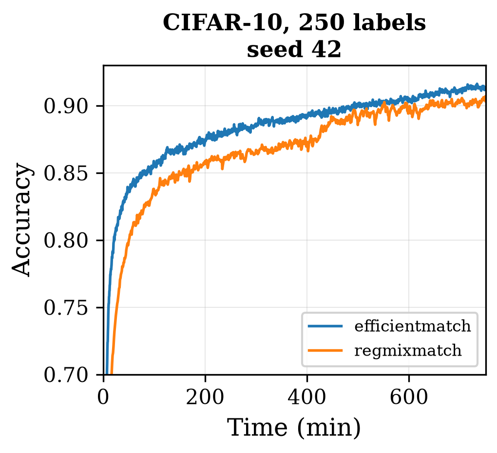
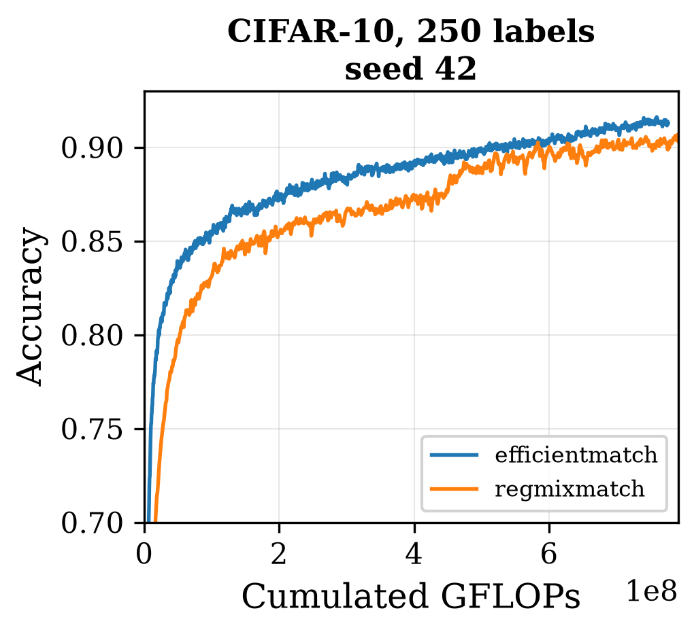

# A preliminary look beyond the tested regime

Backs **Table 11** and **Appendix A.8** of the paper.

```bash
python run_experiment.py --experiment asymptotic     # 2 runs, over 12 hours each
```

Everything else in this repository measures how fast a method reaches a **pre-asymptotic** target.
This diagnostic asks the opposite question: how far does the speed advantage extend once the target
is removed entirely?

## Protocol

CIFAR-10, 250 labels, WRN-28-2, EfficientMatch and RegMixMatch, **no target accuracy and no time
budget**, for the full 2^20-iteration horizon. The seed is **42**, deliberately distinct from the
three used elsewhere, because of the compute cost: each run needs more than 12 hours.

| | EfficientMatch | RegMixMatch |
|---|---|---|
| Iterations completed | 1 048 576 (full horizon) | **418 500, stopped manually at 40% of the horizon** |
| Run time | 749.4 min (12.5 h) | 750.6 min (12.5 h) |
| Evaluations | 2 099 | 838 |
| Accuracy at the last evaluation | 91.25% | 90.33% |
| Best accuracy | **91.62%** (step 1 026 000) | **90.69%** (step 418 000) |
| Speed | ~43 ms / iteration | ~108 ms / iteration |

**RegMixMatch was not run to term.** Completing its horizon would have taken about 30 hours, so it
was stopped after 12.5 hours with its cosine learning rate still far from annealing. Its asymptotic
accuracy is therefore not established, and this comparison should be read as indicative only.

<p align="center">
  
  
  
</p>

*EfficientMatch and RegMixMatch without any target, CIFAR-10/250, seed 42, against iterations,
time and FLOPs.*

## Savings at each accuracy milestone

Absolute time and FLOPs EfficientMatch saves over RegMixMatch to first reach each level:

| Accuracy | Time saved (min) | FLOPs saved (TFLOPs) | Speed factor |
|---:|---:|---:|---:|
| 70% | 9 | 9 994 | 2.26x |
| 75% | 17 | 18 013 | 2.60x |
| 80% | 29 | 31 502 | 2.41x |
| 85% | 65 | 70 157 | 1.91x |
| 88% | 221 | 236 343 | 2.09x |

From 70% to 88%, the absolute savings grow monotonically while the speed factor itself stays in a
stable 1.9x to 2.6x band. EfficientMatch plateaus around 91-92%.

Beyond 88% no conclusion is possible: accuracy oscillates by about ±0.3 points between evaluations,
which makes crossing times unreliable, and RegMixMatch's run is incomplete in that range.

## At matched iteration count

Ranked by iterations rather than by accuracy, the picture reverses:

| Iterations | EfficientMatch | RegMixMatch |
|---:|---:|---:|
| 5 000 | 53.51% | 60.13% |
| 20 000 | 77.72% | 77.69% |
| 50 000 | 82.48% | 82.56% |
| 100 000 | 84.82% | 85.54% |
| 200 000 | 86.68% | 87.23% |
| 400 000 | 88.28% | 90.08% |

From 100 000 steps onward RegMixMatch is slightly more accurate, consistent with its larger mu = 7
extracting more signal per iteration than EfficientMatch's mu = 3, at a proportionally higher
per-iteration cost. EfficientMatch's advantage comes from the cost of each step, not from a better
gain per step — which is exactly the distinction the three-metric protocol is built to surface.

The figures above are `figures/unlimited_efficientmatch_vs_regmixmatch_acc_vs_{steps,time,flops}_cifar10_250_seed42.png`.
