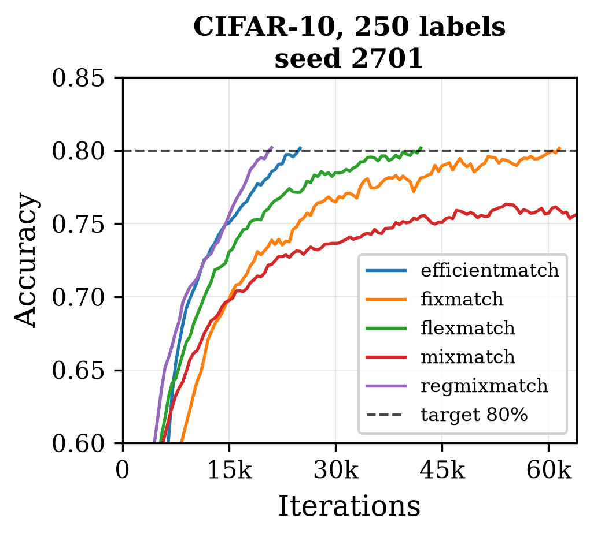
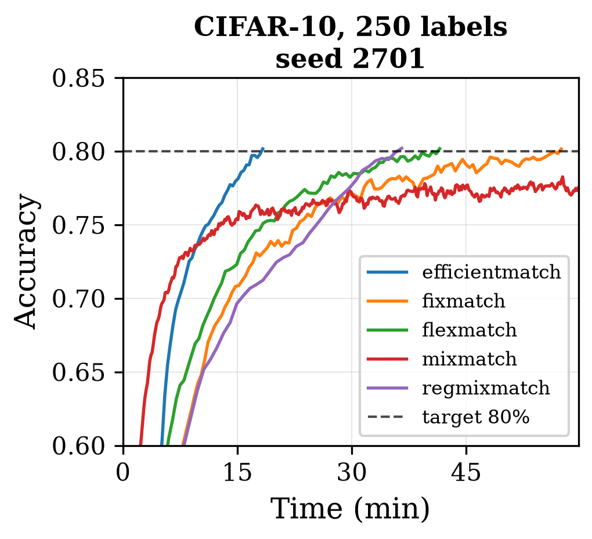
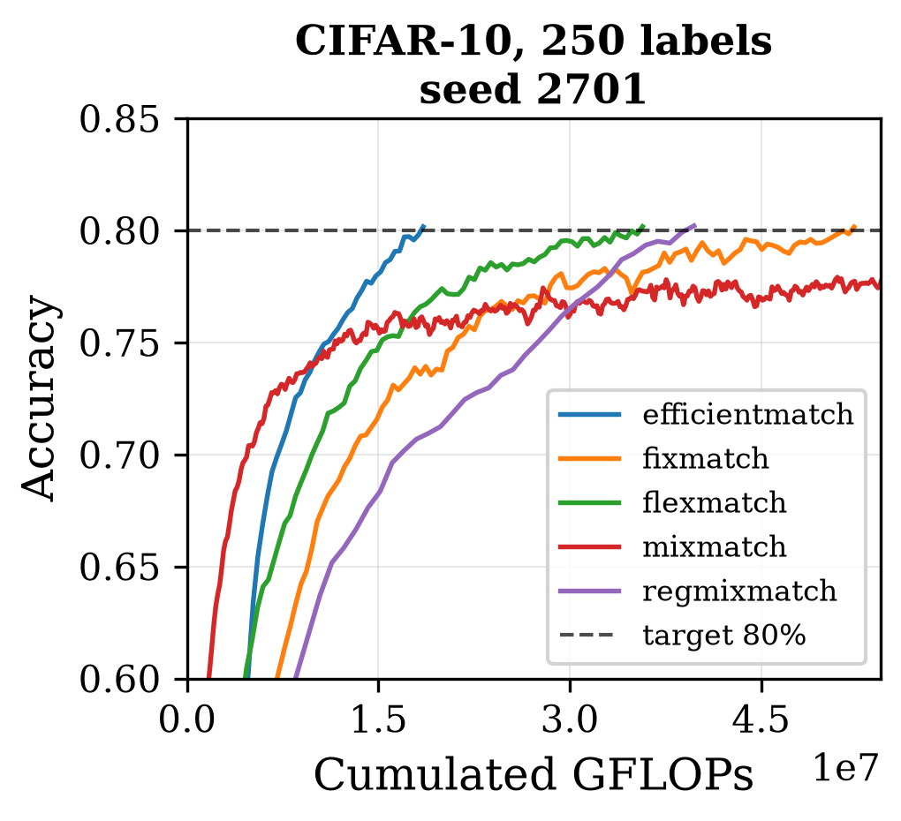
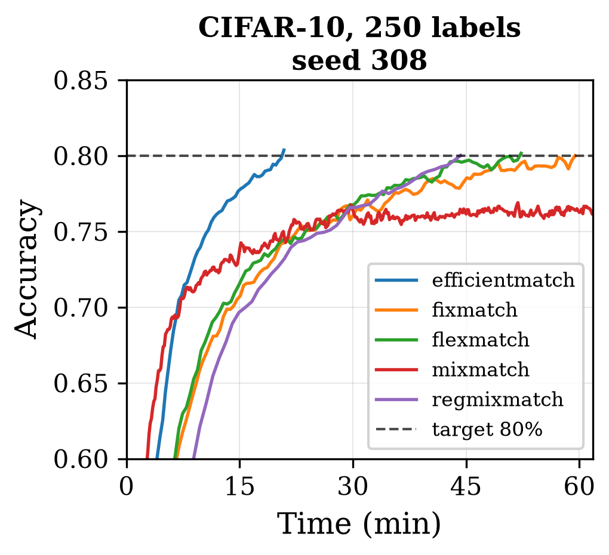

# Main experiment

Backs **Tables 2, 3, 12 and 13** of the paper, plus **Table 4** and **Appendix A.5** for the
adaptive-thresholding variant.

Reproduce it with:

```bash
python run_experiment.py --experiment main          # 60 runs
python run_experiment.py --experiment freematch     # 12 runs, Table 4
```

## Protocol

Five methods — EfficientMatch, FixMatch, FlexMatch, MixMatch, RegMixMatch — on four
dataset / label-budget combinations, over three seeds (2312, 0308, 2701).

| Configuration | Architecture | Target accuracy |
|---|---|---:|
| SVHN, 250 labels | WRN-28-2 | 90% |
| CIFAR-10, 250 labels | WRN-28-2 | 80% |
| CIFAR-10, 4000 labels | WRN-28-2 | 90% |
| CIFAR-100, 2500 labels | WRN-28-4 | 50% |

Each run stops as soon as the EMA accuracy reaches its target, or once it has been training for two
hours. A run that never reaches its target within that budget is marked `†` and excluded from
rankings; the accuracy it plateaued at is given in parentheses.

Each method keeps the unlabeled:labeled ratio established for it in the literature — FixMatch,
FlexMatch and RegMixMatch use mu = 7, MixMatch mu = 1, EfficientMatch mu = 3 — so the per-iteration
cost differs between methods by design. That is precisely what the three metrics are there to
expose: iterations measure algorithmic efficiency per optimization step, wall-clock time captures
the cost of machinery executed inside the training loop, and FLOPs measure compute independently of
the hardware and software stack. A method that is efficient in the sense of this work has to be so
on all three at once.

RegMixMatch runs 2,048 supervised-only iterations on the labeled batch before training proper, to
seed the moving averages of its adaptive threshold (`--warmup_steps`). These iterations run before
the clock starts: they count neither in the reported time, nor in the number of iterations, nor in
the FLOPs.

## Iterations to reach the target (×1000)

| Method | SVHN-250 | | | CIFAR-10-250 | | | CIFAR-10-4000 | | | CIFAR-100-2500 | | |
|---|---:|---:|---:|---:|---:|---:|---:|---:|---:|---:|---:|---:|
| seed | 2312 | 0308 | 2701 | 2312 | 0308 | 2701 | 2312 | 0308 | 2701 | 2312 | 0308 | 2701 |
| EfficientMatch | 7.0 | 6.5 | 8.0 | 42.0 | 28.5 | 25.0 | 41.0 | 41.0 | 43.5 | 30.5 | 26.5 | 32.0 |
| FixMatch | 8.0 | 6.5 | 8.0 | 127.0 | 64.0 | 61.5 | 99.0 | 91.5 | 100.5 | † | † | † |
| FlexMatch | † | † | † | 65.5 | 52.5 | 42.0 | 60.5 | 90.0 | 83.5 | 31.5 | 38.0 | 31.5 |
| MixMatch | 18.5 | 52.5 | 35.0 | † | † | † | 198.5 | 213.5 | 165.5 | † | † | † |
| RegMixMatch | **5.5** | **4.5** | **6.0** | **35.0** | **25.5** | **21.0** | **25.0** | **27.0** | **27.0** | **17.5** | **15.0** | **20.0** |

## Wall-clock time to reach the target, corrected (minutes)

Corrected time subtracts the cost of the periodic evaluations, which is the same for every method at
a given architecture and reflects nothing about the training mechanism being compared: 553.7 ms per
evaluation pass for WRN-28-2, 1499.1 ms for WRN-28-4.

| Method | SVHN-250 | | | CIFAR-10-250 | | | CIFAR-10-4000 | | | CIFAR-100-2500 | | |
|---|---:|---:|---:|---:|---:|---:|---:|---:|---:|---:|---:|---:|
| seed | 2312 | 0308 | 2701 | 2312 | 0308 | 2701 | 2312 | 0308 | 2701 | 2312 | 0308 | 2701 |
| EfficientMatch | **5.7** | **5.2** | **6.3** | **29.6** | **20.3** | **17.9** | **28.2** | **29.3** | **29.8** | **55.1** | **48.1** | **58.0** |
| FixMatch | 7.7 | 6.3 | 7.7 | 113.7 | 58.2 | 56.3 | 85.2 | 79.1 | 86.9 | † | † | † |
| FlexMatch | † | † | † | 63.3 | 51.3 | 40.7 | 58.1 | 86.4 | 76.8 | 69.2 | 82.8 | 68.0 |
| MixMatch | 6.5 | 17.4 | 11.8 | † | † | † | 55.5 | 59.6 | 46.3 | † | † | † |
| RegMixMatch | 10.2 | 8.2 | 11.2 | 60.6 | 43.8 | 36.1 | 42.9 | 46.2 | 47.2 | 61.0 | 52.5 | 70.1 |

Accuracy against time, all five methods, seed 2312, one panel per configuration (Figure 4 of the
paper). Dashed lines mark the target.

<p align="center">
  
  
  
  
</p>

## FLOPs to reach the target (PFLOPs)

| Method | SVHN-250 | | | CIFAR-10-250 | | | CIFAR-10-4000 | | | CIFAR-100-2500 | | |
|---|---:|---:|---:|---:|---:|---:|---:|---:|---:|---:|---:|---:|
| seed | 2312 | 0308 | 2701 | 2312 | 0308 | 2701 | 2312 | 0308 | 2701 | 2312 | 0308 | 2701 |
| EfficientMatch | **5.2** | **4.8** | **5.9** | **31.1** | **21.1** | **18.5** | **30.4** | **30.4** | **32.2** | **89.0** | **77.4** | **93.5** |
| FixMatch | 6.8 | 5.5 | 6.8 | 108.0 | 54.4 | 52.3 | 84.2 | 77.8 | 85.4 | † | † | † |
| FlexMatch | † | † | † | 55.7 | 44.6 | 35.7 | 51.4 | 76.5 | 71.0 | 105.7 | 127.5 | 105.7 |
| MixMatch | 5.6 | 15.8 | 10.6 | † | † | † | 59.9 | 64.4 | 49.9 | † | † | † |
| RegMixMatch | 10.4 | 8.5 | 11.4 | 66.2 | 48.2 | 39.7 | 47.3 | 51.1 | 51.1 | 130.7 | 112.0 | 149.3 |

## Raw wall-clock time (minutes)

Total elapsed time of each run, evaluation included. This is the reference measurement of observed
duration; the corrected column above is what the comparison is based on.

| Method | SVHN-250 | | | CIFAR-10-250 | | | CIFAR-10-4000 | | | CIFAR-100-2500 | | |
|---|---:|---:|---:|---:|---:|---:|---:|---:|---:|---:|---:|---:|
| seed | 2312 | 0308 | 2701 | 2312 | 0308 | 2701 | 2312 | 0308 | 2701 | 2312 | 0308 | 2701 |
| EfficientMatch | 5.8 | 5.3 | 6.5 | 30.4 | 20.9 | 18.3 | 29.0 | 30.1 | 30.6 | 58.1 | 49.5 | 59.6 |
| FixMatch | 7.8 | 6.4 | 7.9 | 116.0 | 59.4 | 57.4 | 87.1 | 80.8 | 88.8 | † | † | † |
| FlexMatch | † | † | † | 64.6 | 52.3 | 41.5 | 59.2 | 88.1 | 78.3 | 70.8 | 84.8 | 69.6 |
| MixMatch | 6.8 | 18.4 | 12.4 | † | † | † | 59.2 | 63.6 | 49.3 | † | † | † |
| RegMixMatch | 10.3 | 8.2 | 11.3 | 61.2 | 44.3 | 36.5 | 43.4 | 46.7 | 47.7 | 61.9 | 53.3 | 71.1 |

Accuracies reached by the runs marked `†`: FlexMatch on SVHN plateaus at 84.0%, 82.5% and 86.7%;
MixMatch on CIFAR-10/250 at 76.5%, 77.7% and 79.5%; on CIFAR-100/2500, FixMatch at 46.8%, 48.1% and
47.0%, MixMatch at 46.4%, 46.5% and 45.7%.

## What the numbers show

**EfficientMatch's speed.** Across all twelve seed/configuration combinations, EfficientMatch
achieves the lowest wall-clock time and the lowest FLOP cost of the five methods, without a single
exception. RegMixMatch is the only method that ever converges in fewer iterations, but only by
paying a substantially higher per-iteration cost, which is exactly what the wall-clock and FLOP
metrics are designed to expose. This consistency holds across the full range of conditions tested,
from 250 to 4000 labels, from 10 to 100 classes, on two architectures, and even including SVHN/250,
the one configuration where FlexMatch and RegMixMatch's adaptive thresholding otherwise dominates in
isolation.

**The MixMatch reversal.** On CIFAR-10, MixMatch's relative position reverses between the two label
budgets: at 250 labels it never reaches 80% within the allowed budget on any of the three seeds; at
4000 labels it converges reliably across all three and becomes 1.05x to 1.9x faster than FixMatch
and FlexMatch, depending on the seed. SVHN at 250 labels shows a similar but less uniform pattern:
MixMatch is markedly slower and more FLOP-costly than FixMatch on two of the three seeds (up to
2.9x), but on the third it is instead slightly faster and cheaper (0.8x), consistent with the higher
inter-seed variance documented for MixMatch throughout this work. This reversal directly supports
the paper's diagnosis: Mixup extracts more useful signal the higher the quality of the labels it has
access to, but becomes a liability, to the point of preventing convergence within the allowed
budget, when the pseudo-labels available early in training are scarce and unreliable.

**Evaluation bias of the standard protocol.** RegMixMatch is consistently the most efficient method
per iteration across the four configurations; yet when evaluated in terms of compute time and FLOPs,
the ranking changes entirely depending on the configuration.

<p align="center">
  
  
  
</p>

*Figure 2 of the paper: convergence on CIFAR-10/250, seed 2701, along the three criteria:
iterations (left), time (middle), and FLOPs (right). The three criteria rank methods differently.
RegMixMatch appears highly efficient per iteration, whereas EfficientMatch is more efficient on the
other two criteria, except early in training, where MixMatch dominates before reaching its
plateau.*

**Slow-convergence failures.** The configurations reveal several methodological limitations, of
different nature depending on the method. The simplest configuration, CIFAR-10/4000, allows every
method to converge within the allowed time, unlike the other three. On SVHN/250, FlexMatch's
adaptive thresholding plateaus at 82-87%, never reaching 90% regardless of run duration: a
convergence failure rather than a speed one, consistent with FlexMatch's own published results on
this dataset. On CIFAR-10/250, by contrast, MixMatch fails by slowness rather than by a ceiling: the
80% threshold is below its known asymptotic performance under the full protocol, but convergence is
too slow to cross it within the two-hour budget on every seed. CIFAR-100/2500 reproduces this same
speed failure for MixMatch, and also causes FixMatch to fail for the same reason, both plateauing at
45-48%.

**Inter-seed variability.** The same configuration, CIFAR-10/250, on its three seeds (Figure 5 of
the paper). Both the ranking and the qualitative behaviour of each method change substantially from
seed to seed, which is why the paper reports no averaged performance.

<p align="center">
  
  
  
</p>

## The FreeMatch-thresholding variant (Table 4)

EfficientMatch's fixed, reused threshold can be replaced by FreeMatch's self-adaptive thresholding,
with `--freematch_threshold True`. Averaged over three seeds, this reduces the iterations needed to
reach the target:

| Configuration | 2312 | 0308 | 2701 | Mean |
|---|---:|---:|---:|---:|
| SVHN, 250 labels (clamp active) | −14% | −8% | −25% | −16% |
| CIFAR-10, 250 labels | −1% | −25% | −22% | −16% |
| CIFAR-10, 4000 labels | −38% | −31% | −29% | −32% |
| CIFAR-100, 2500 labels | −47% | −45% | −50% | −48% |

The gain grows as labels and classes increase, but it comes at the cost of a dataset-specific patch:
on SVHN the threshold has to be clamped to [0.9, 0.95], following a correction FreeMatch's authors
document for this dataset. Without it, the variant never reaches 90% on any seed, peaking at
84.2-86.3% before degrading to 82-83% as the mask keeps admitting an increasing share of unreliable
pseudo-labels.

This failure is not specific to this implementation. RegMixMatch shares the same thresholding
mechanism and exhibits the same failure mode on SVHN without the clamp: on seed 2312 it peaks at
84.65% after 19,000 steps (33.6 min), then degrades to 81.8% by 70,500 steps (119 min), never
approaching 90% — against 90.51% in 5,500 steps (10.3 min) with the clamp in place. Adaptive
thresholding can thus accelerate convergence substantially, but at the cost of a per-dataset
adjustment that compromises robustness, precisely what EfficientMatch's reused fixed threshold
avoids across all four configurations.

Reproduce both halves of that comparison with:

```bash
python run_experiment.py --experiment freematch
python run_experiment.py --experiment freematch-noclamp
```

## A caveat on the wall-clock numbers

Step counts and FLOPs do not depend on how fast the machine runs. Wall-clock time does: while checking the per-step time of
every run, the machine was found to have occasionally run 20% to 200% slower than usual, with no
concurrent job recorded and no cause identified. Runs affected by this were replayed, and two of
them are the numbers reported above:

| Run | ms/step measured | median for that method and configuration | Action |
|---|---:|---:|---|
| EfficientMatch, CIFAR-10/4000, seed 2701 | 57.4 | 44 | replayed: 30.6 min at 42 ms/step, instead of 41.1 min |
| RegMixMatch, CIFAR-100/2500, seed 2312 | 273 | 213 | replayed: 61.9 min at 212 ms/step, instead of 87.5 min |
| MixMatch, CIFAR-10/250, seed 2312 | 56.5 | 18.8 | not replayed; the run is cut at the 2-hour budget anyway and never reaches the target |

FixMatch on CIFAR-10/250 seed 2312 shows the same effect from the other side: a first run took
272.5 min to reach 80%, and a second run of strictly identical code took 116.0 min. The second is
the one reported, and the first is kept as `fixmatch_ema_orig_metrics.json`. Because this variance
affects only wall-clock time and leaves iterations and FLOPs untouched, it does not change any of
the rankings above.
